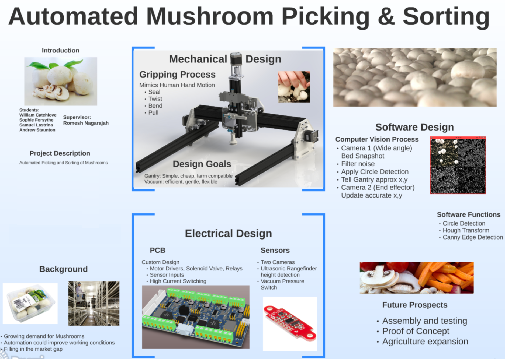
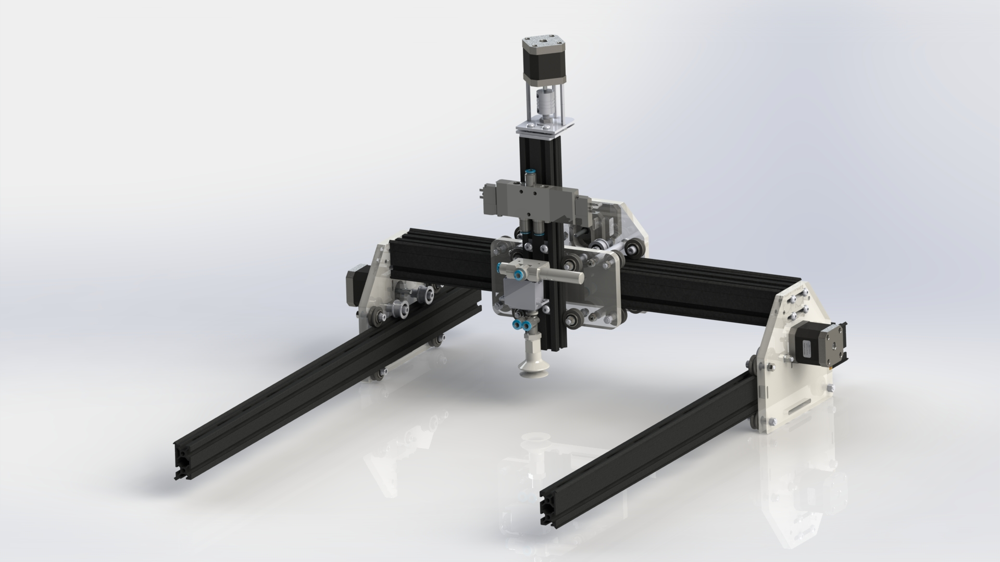
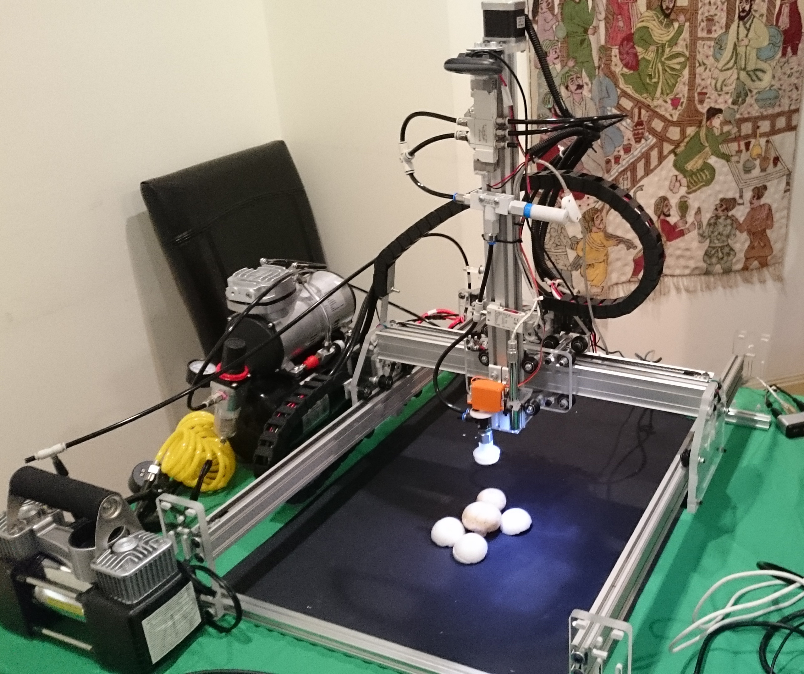
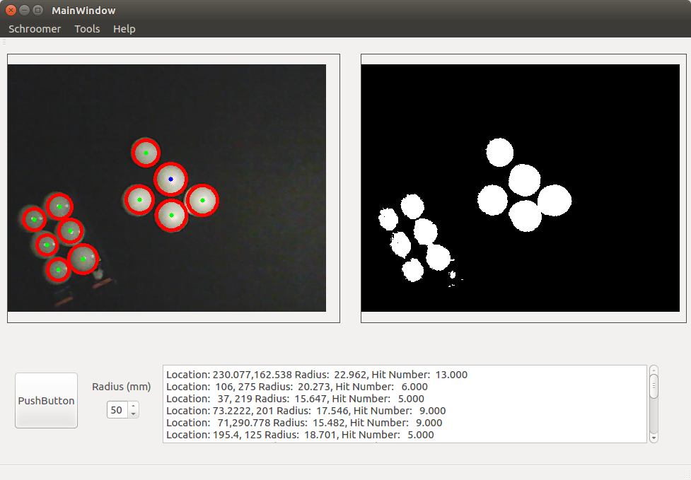
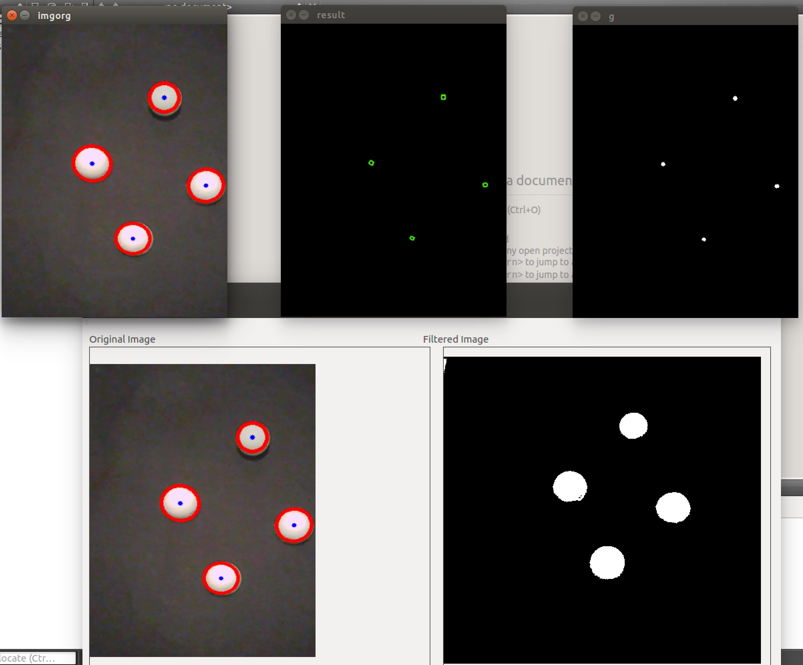

# Shroombot/Shroomba
Automated Mushroom Picking and Sorting Robot - Swinburne Final Year Robotics Project 2015

**Description:** This project involves the design, development, fabrication and field testing of a robotic device for
picking mushrooms. The robot will also incorporate a computer vision system to aid in picking and
for sorting the mushrooms.

### Contributors
* Samuel Lastrina
* Sophie Forsythe
* Andrew Staunton
* Will Catchlove

### Poster Presentation

### Gantry

### Software

### Demonstration Videos

  

